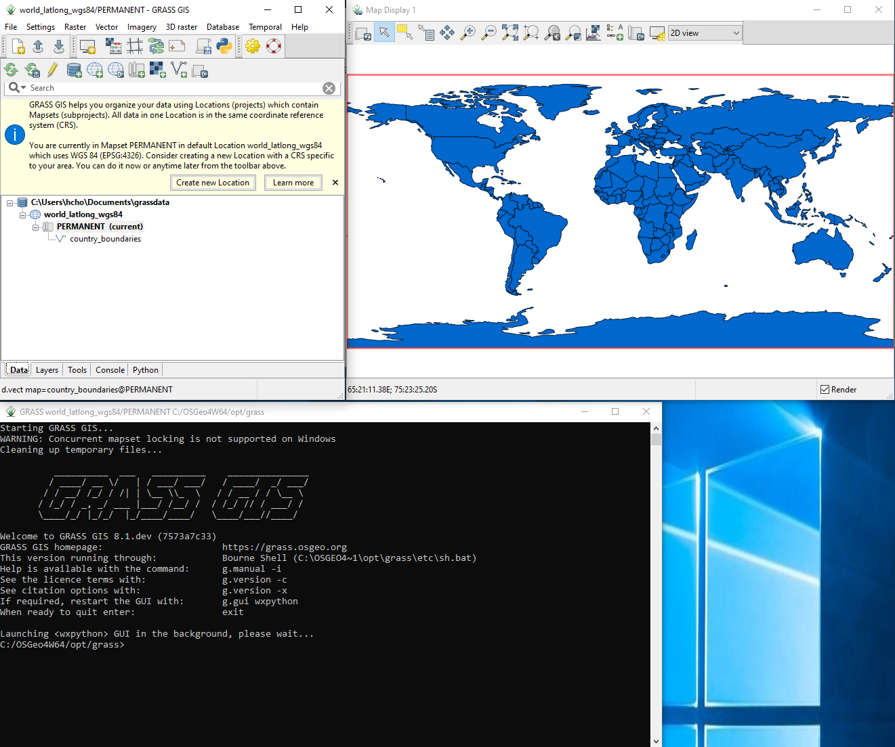

Basics
======

First look
----------

Let's run GRASS for the first time by clicking the shortcut.

GRASS consists of three windows including the main GUI (top left), map display (top right), and the terminal (bottom).
By default, it comes with a country boundaries vector map in the PERMANENT mapset of the world_latlong_wgs84 location.
The Coordinate Reference System (CRS) of this default location is `EPSG:4326 <https://epsg.org/crs_4326/WGS-84.html>`_.

Close the information popup and play in the display window.
Hover the mouse cursor over each icon and see help messages.
For more information, check `the wxGUI manual <https://grass.osgeo.org/grass80/manuals/wxGUI.html>`_.

Data structure
--------------

GRASS organizes geospatial data into its own open-data structure.
The GRASS data structure is hierarchically divided into three physical layers or directories including databases, locations, and mapsets.
A database typically contains multiple locations, which in turn can consist of multiple mapsets.
Raster and vector maps are stored in a mapset.
See the following database directory structure:

::

 database
 |
 +- location
 |  |
 |  +- PERMANENT
 |  |  |
 |  |  +- raster
 |  |  +- raster
 |  |  +- vector
 |  |  +- vector
 |  |
 |  +- mapset
 |     |
 |     +- vector
 |     +- vector
 |
 +- location
    |
    +- PERMANENT
       |
       +- raster
       +- raster
       +- vector

Unlike locations and mapsets, which have their parent layer, a database is at the top level and has no parents.
In other words, multiple databases do not have to belong to a parent directory and they can be dispersed across the storage device.

A CRS is assigned to a location, which means that a location's child mapsets and their maps share the same CRS of the location.
In one location, maps with different CRSs cannot be stored.

Each location has a special mapset called PERMANENT.
GRASS was originally designed with concurrent multi-user environments like UN*X in mind.
The PERMANENT mapset provides a common place for shared maps.
Maps in this mapset are accessible from other mapsets in the same location by default.

Non-PERMANENT mapsets can be created by a user and, depending on read/write permissions, other users may or may not have access to maps in a non-PERMANENT mapset.
On Windows where typically only one user is logged in and acitive at a time, this permission concept is not really relevant.

Module naming
-------------

GRASS has naming conventions for module names.
The main data type that a module handles becomes a prefix.
For example, a module dealing mostly with raster data starts with ``r.``.
The full list of prefixes is as follows:

* ``d.`` for display modules
* ``db.`` for database modules
* ``g.`` for general modules
* ``i.`` for imagery modules
* ``m.`` for miscellaneous modules
* ``ps.`` for PostScript modules
* ``r.`` for raster modules
* ``r3.`` for 3D raster (voxel) modules
* ``t.`` for temporal modules
* ``v.`` for vector modules
