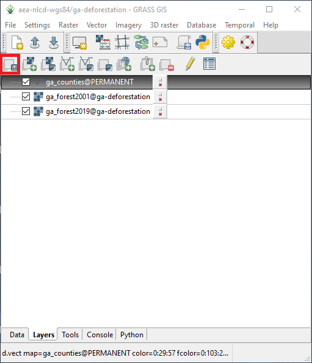
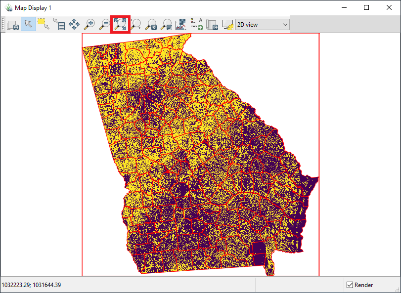

Displaying maps together
========================

Using the highlighted icon below, we can add multiple maps at once.

Zoom to the study area by selecting ga_counties and clicking the zoom to layer button.
Go to the properties window of ga_counties, and change the feature and area fill colors to red and transparent, respectively.

