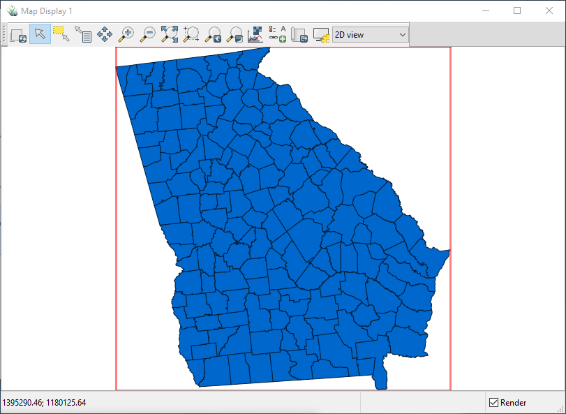

Importing data
==============

Importing Georgia counties data
-------------------------------

Similar to the three raster modules above, there are three vector modules that we can use to import vector data:

* v.in.ogr: Imports vector data into the current or a new location
* v.import: Imports and reprojects vector data on the fly into the current location
* v.external: Links external vector data sources as a pseudo vector map

Since Counties_Georgia.shp is small, let's use v.import to import/reproject it into the NLCD location.

.. code-block:: bash

   v.import input=Counties_Georgia.shp output=ga_counties

Reload the current mapset and add ga_counties to the map display.

Linking NLCD data
-----------------

Now, we need to link the NLCD data sets as pseudo GRASS raster maps since the data is just too large.

.. code-block:: bash

   r.external -e input=nlcd_2001_land_cover_l48_20210604.img output=nlcd2001
   r.external -e input=nlcd_2019_land_cover_l48_20210604.img output=nlcd2019

We used the ``-e`` flag to extend the extent of the location to each data set.
